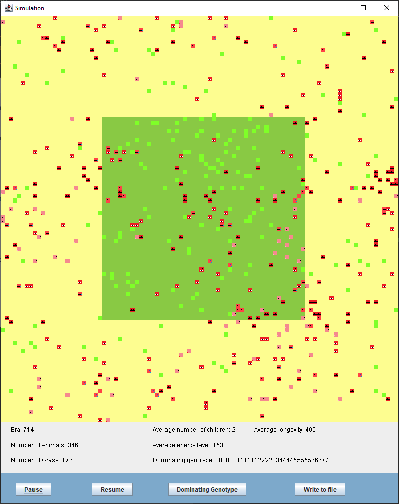

# GameOfLife

Project is a part of OOP course at AGH University of Science and Technology. Detailed instruction(in polish) is available here: https://github.com/apohllo/obiektowe-lab/tree/master/lab8

## Start menu
Type in values. To start the simulation click "Start".

## Simulation
Shows current positions of animals and grass. Detailed statistics are shown below the map, being updated every era.

